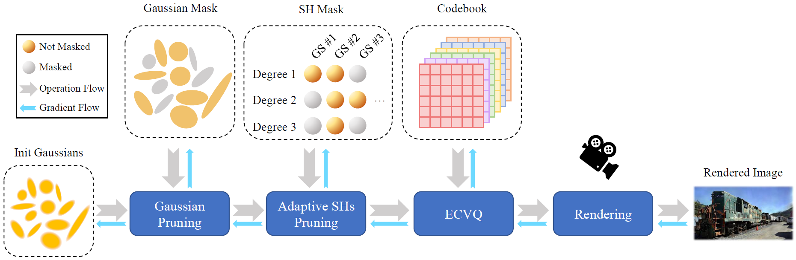
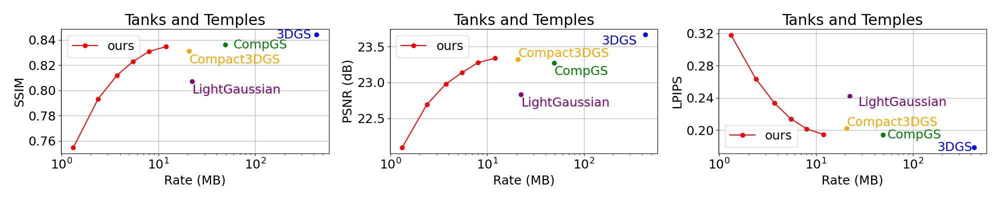
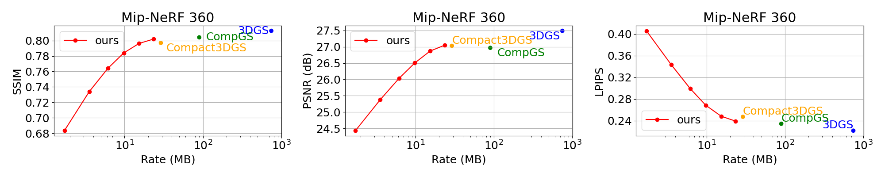
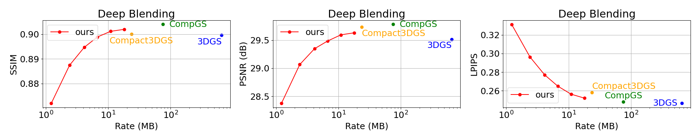
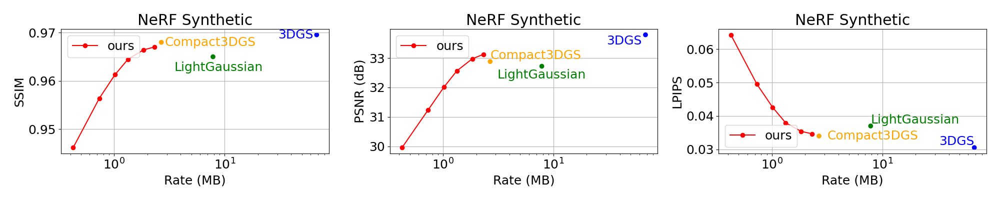

# [ECCV 2024] RDO-Gaussian

## [Project Page](https://rdogaussian.github.io/) | [Paper](https://arxiv.org/pdf/2406.01597.pdf)

Official Pytorch implementation of End-to-End Rate-Distortion Optimized 3D Gaussian Representation.

## Abstract

3D Gaussian Splatting (3DGS) has become an emerging technique with remarkable potential in 3D representation and image rendering. However, the substantial storage overhead of 3DGS significantly impedes its practical applications. In this work, we formulate the compact 3D Gaussian learning as an end-to-end Rate-Distortion Optimization (RDO) problem and propose RDO-Gaussian that can achieve flexible and continuous rate control. RDO-Gaussian addresses two main issues that exist in current schemes: 1) Different from prior endeavors that minimize the rate under the fixed distortion, we introduce dynamic pruning and entropy-constrained vector quantization (ECVQ) that optimize the rate and distortion at the same time. 2) Previous works treat the colors of each Gaussian equally, while we model the colors of different regions and materials with learnable numbers of parameters. We verify our method on both real and synthetic scenes, showcasing that RDO-Gaussian greatly reduces the size of 3D Gaussian over 40$\times$, and surpasses existing methods in rate-distortion performance.

## Pipeline



## Installation

We recommend using conda environment for installation.
```shell
conda env create --file environment.yml
conda activate rdo-gaussian
```
## Dataset

In our paper, we use:
- 3 real-world dataset
  - [Mip-NeRF 360](https://jonbarron.info/mipnerf360/)
  - Tanks&Temples
  - Deep Blending
  
  The scenes from Tanks&Temples and Deep Blending dataset can be downloaded [here](https://repo-sam.inria.fr/fungraph/3d-gaussian-splatting/datasets/input/tandt_db.zip).
- 1 synthetic dataset
  - [NeRF Synthetic](https://drive.google.com/drive/folders/128yBriW1IG_3NJ5Rp7APSTZsJqdJdfc1).

## Run

To train on synthetic scenes, please run the following scripts:

```shell
bash scripts/run_synthetic.sh
```

To train on real-world scenes, please run the following scripts:

```shell
bash scripts/run_real_world.sh
```

The script includes training, rendering and evaluating processes on all 6 rate points.

Please specify dataset path and scene in the script before running.

## Results






## Citation

If you want to cite our work, please kindly use:

```
@inproceedings{wang2024rdogaussian,
      title={End-to-End Rate-Distortion Optimized 3D Gaussian Representation},
      author={Wang, Henan and Zhu, Hanxin and He, Tianyu and Feng, Runsen and Deng, Jiajun and Bian, Jiang and Chen, Zhibo},
      booktitle={European Conference on Computer Vision},
      year={2024}
    }
```

## Licence

Please follow the LICENSE of [3D-GS](https://github.com/graphdeco-inria/gaussian-splatting).
